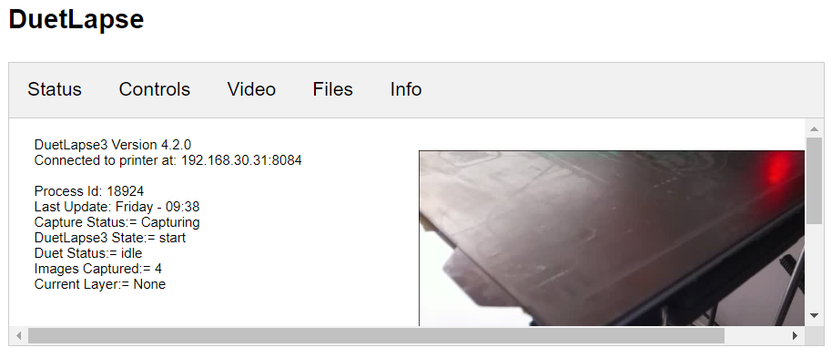
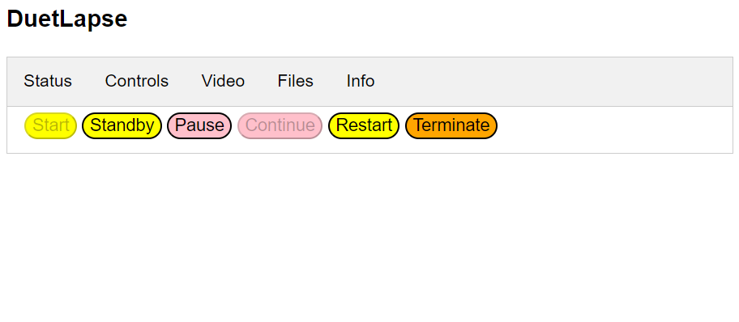
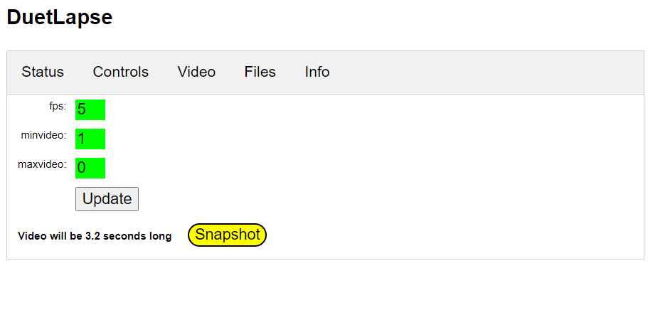
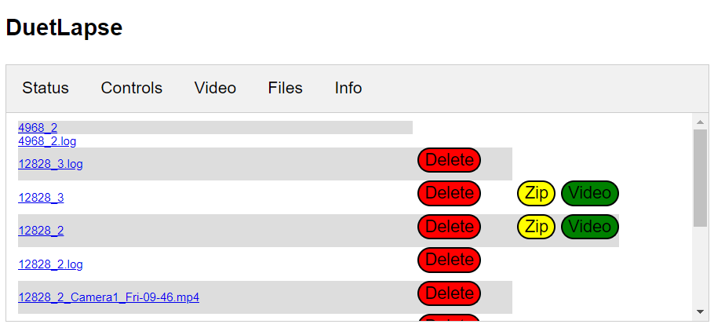
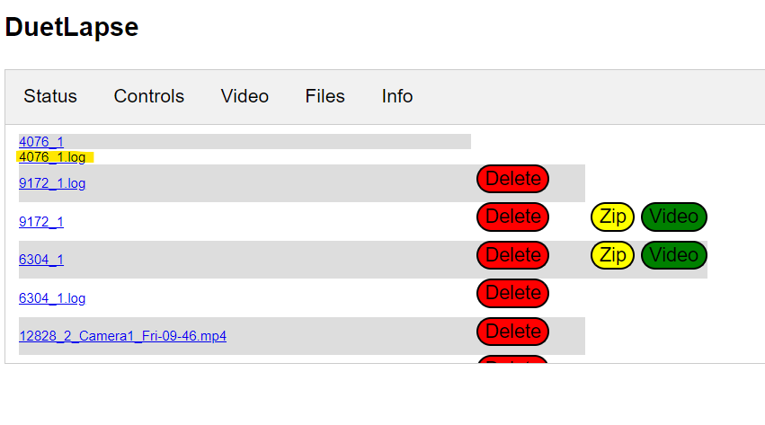
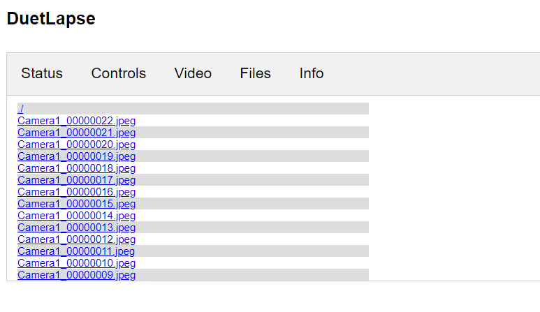
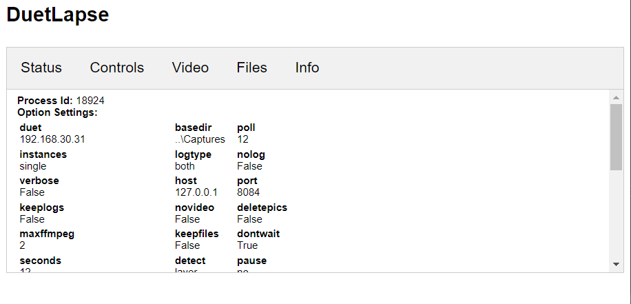

## User Interface

DuetLapse has a browser based, user interface, provided through its internal http server.

### Accessing the user interface

To access the user interface use:
http://localhost:[port] (e.g. http://localhost:8081) or http://[ip][port] (http://192.168.1.10:8081).

If you are running the browser on the same computer that is running DuetLapse: localhost will likely work.

If the browser is running on a remote computer then [ip] is the address of the computer that is running DuetLapse.

In both cases [port] is the port number set by the -port option used with DuetLapse

The user interface is navigated by tabs and buttons.

### __Status tab__

The status tab provides basic information about the state of your printer and of DuetLapse.  This tab automatically refreshes 4 times for each poll of the printer. Note that other tabs do not automatically refresh.

### __Controls Tab__

The Controls tab allows the state of DuetLapse to be changed.  The controls are enabled, logically, based on the current state.  For example "Continue" is only available if the current state is "Pause' (and vice versa).  Also, if you use the -hidden option, disabed controls will not be visible.

The function of each button is:

__Start:__  DuetLapse is able to capture images.

__Standby:__  Deletes any current images and places DuetLapse in standby mode.

__Pause:__  Stops the capture of images until "Continue"

__Continue:__  Continues the capture of Images

__Restart:__  Will attempt to create a video anf then return to either the Start or Standby state ( depends on the -standby option)

__Terminate:__  Displays options to terminate gracefully (i.e. attempt to create a video) or forcefully (shuts down DuetLapse).  If the -restat option is set, DuetLapse will restart after Graceful but will not after Forced.

### __Video Tab__

The video tab allows changes to the options that affect video creation. These are updated either by using the update button or by changing one value and pressing enter. 

The tab also provides information on how long the video (for the current print job) would be.  __This information is refreshed shortly after a change is made.__

The __snapshot__ button is used to create a video during the current print job.

Note that these settings also affect the length of a video when using the video button in the files tab (see below). 

### __Files Tab__

The files tab provides a view into the directory set by -basedir.  The content of this directory depends on other settings (e.g -keepfiles).

If there is no print job currently running, a logfile (startup.log) is displayed.
If a print job is running and an image has been captured, startup.log is renamed and a folder is created to collect the images.  The new name is prefixed by the process id of the currently running instance of DuetLape (plus a counter).  The logfile and the associated folder cannot be deleted.

Logfiles from previous print jobs can be deleted.  Image folders from previous print jobs can be deleted, a zip file created, and a video created (see Video tab).

__The file tab is refreshed after each action.__

Logfiles and zip files can be downloaded by clicking on the filename.log or filename.zip links

Video files can be viewed by clicking on the filename.mp4 link

Image folders can be viewed by clicking on the link.  Images can be viewed by clicking on the foldername link.

Images can be viewed by clicking on the filename.jpeg link.

### __Info Tab__

The info tab shows the values of all the current options and file / folder locations.

